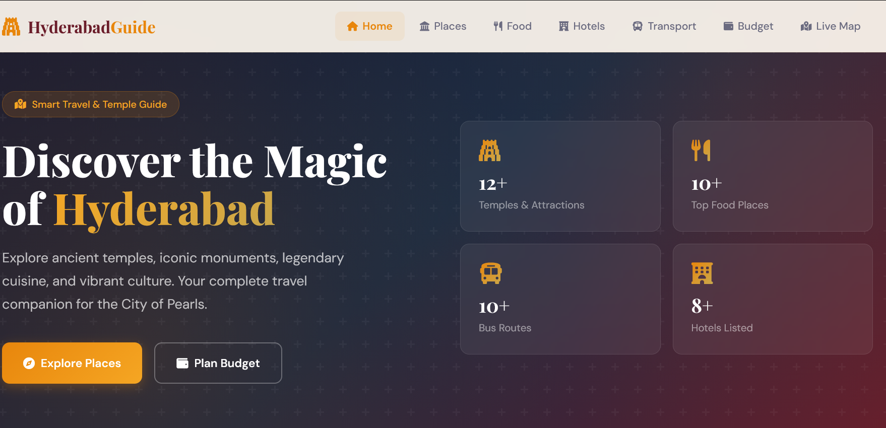
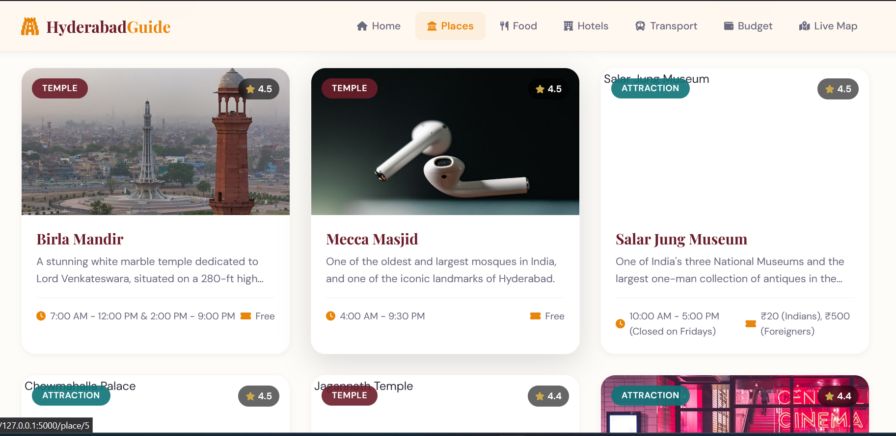
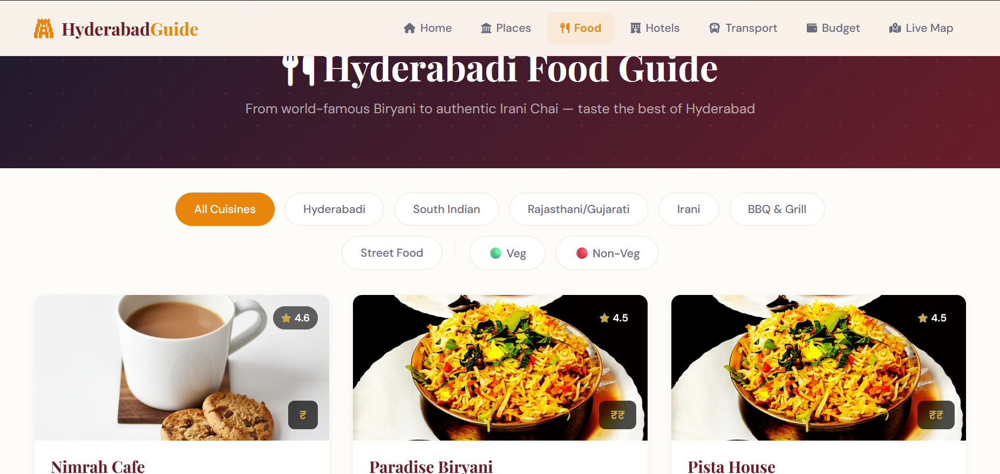
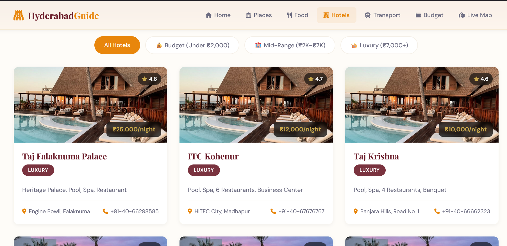
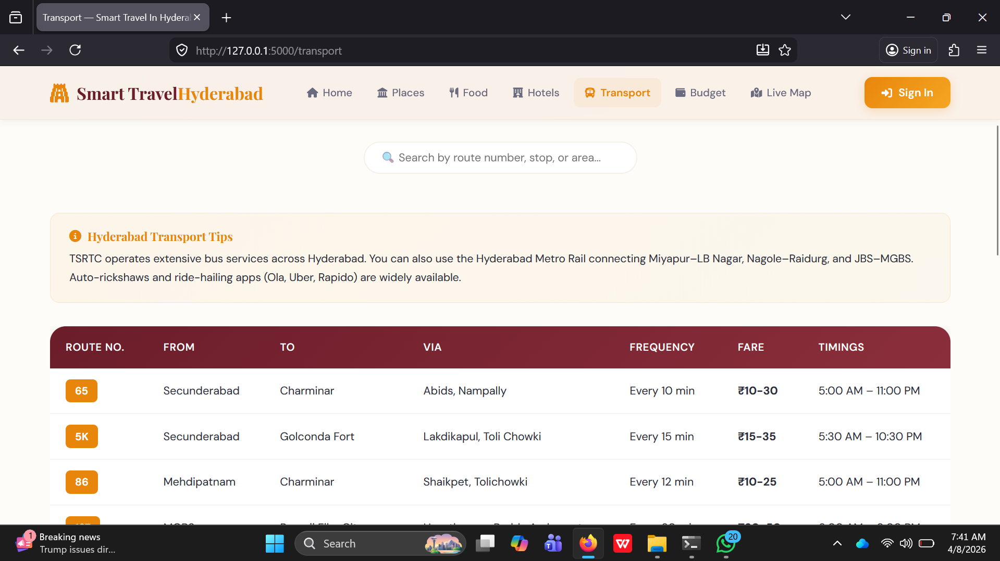
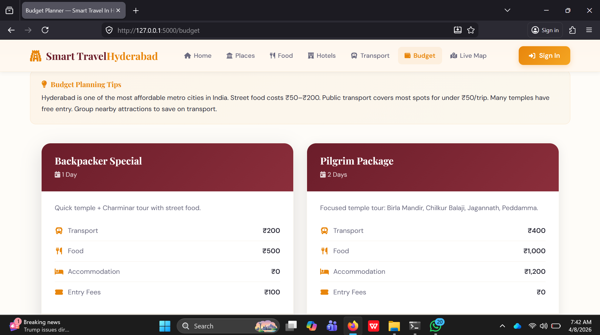

# 🕌 Hyderabad Yatra — Smart Travel & Temple Guide

A full-stack web application that serves as a smart travel guide for Hyderabad, featuring places to visit, food recommendations, hotels, transport, budget planning, and an interactive map — all with user authentication.

🌐 **Live Demo:** [https://hyderabad-yatra-4.onrender.com](https://hyderabad-yatra-4.onrender.com)

> ⚠️ Note: Free tier instance — first load may take ~50 seconds to wake up.

---

## 📸 Screenshots

### 🏠 Home Page

*Discover the Magic of Hyderabad — 12+ Temples, 10+ Food Places, 10+ Bus Routes, 8+ Hotels*

### 🏛️ Places to Visit

*Browse temples and attractions like Birla Mandir, Mecca Masjid, Salar Jung Museum with timings and entry fees*

### 🍜 Food Guide

*Filter by cuisine — Hyderabadi, South Indian, Irani, Street Food, Veg/Non-Veg with ratings*

### 🏨 Hotels

*Filter by Budget, Mid-Range, and Luxury hotels with pricing and contact details*

### 🚌 Transport

*TSRTC bus routes with route numbers, stops, fares, frequency and timings*

### 💰 Budget Planner

*Pre-built trip packages like Backpacker Special (₹800) and Pilgrim Package (₹2,600)*

---

## ✨ Features

- 🔐 **User Authentication** — Login system with session management
- 🏛️ **Places to Visit** — 12+ temples, monuments and attractions with details
- 🍜 **Food Guide** — 10+ top food places with cuisine filters (Veg/Non-Veg)
- 🏨 **Hotels** — 8+ hotels across Budget, Mid-Range and Luxury categories
- 🚌 **Transport** — 10+ TSRTC bus routes with fares and timings
- 💰 **Budget Planner** — Ready-made trip packages with cost breakdown
- 🗺️ **Live Map** — Interactive map with distance calculator
- 📱 **Responsive Design** — Works on mobile and desktop

---

## 🛠️ Tech Stack

| Component | Technology |
|---|---|
| Backend | Python Flask |
| Database | SQLite |
| Frontend | HTML, CSS, JavaScript |
| Templating | Jinja2 |
| Deployment | Render |
| Server | Gunicorn |

---

## 📁 Project Structure

```
hyderabad-travel-guide/
├── app.py                  # Flask backend with all routes
├── requirements.txt        # Python dependencies
├── render.yaml             # Render deployment config
├── templates/
│   ├── base.html           # Base layout
│   ├── index.html          # Home page
│   ├── login.html          # Login page
│   ├── places.html         # Places to visit
│   ├── place_detail.html   # Individual place details
│   ├── food.html           # Food guide
│   ├── hotels.html         # Hotels listing
│   ├── transport.html      # Transport guide
│   ├── budget.html         # Budget planner
│   └── map.html            # Interactive map
└── static/
    ├── css/
    │   └── style.css       # Main stylesheet
    └── js/
        └── main.js         # Frontend JavaScript
```

---

## 🚀 Run Locally

### Prerequisites
- Python 3.8+
- pip

### Steps

```bash
# 1. Clone the repository
git clone https://github.com/sreenidhi-06/hyderabad-yatra.git
cd hyderabad-yatra

# 2. Install dependencies
pip install -r requirements.txt

# 3. Run the app
python app.py
```

Open your browser and go to 👉 **http://127.0.0.1:5000**

---

## ☁️ Deployment

This app is deployed on **Render** (free tier).

### Deploy your own instance
1. Fork this repo
2. Go to [render.com](https://render.com) and connect your GitHub
3. Select this repo → Render auto-detects settings from `render.yaml`
4. Click **Deploy Web Service** — no extra configuration needed!

---

## 👨‍💻 Author

**Sreenidhi** — [GitHub](https://github.com/sreenidhi-06)

---

## 📄 License

This project is open source and available under the [MIT License](LICENSE).
